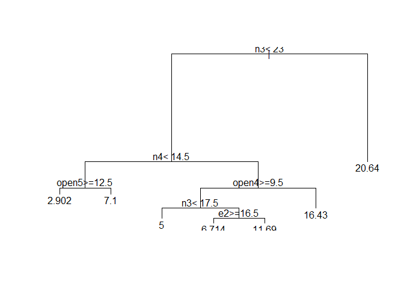
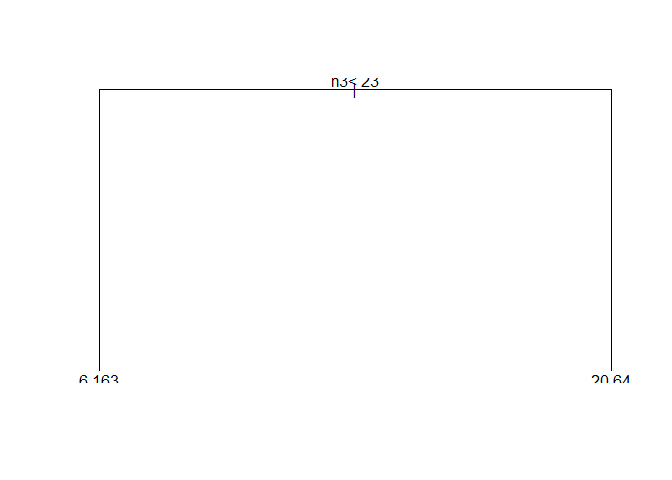
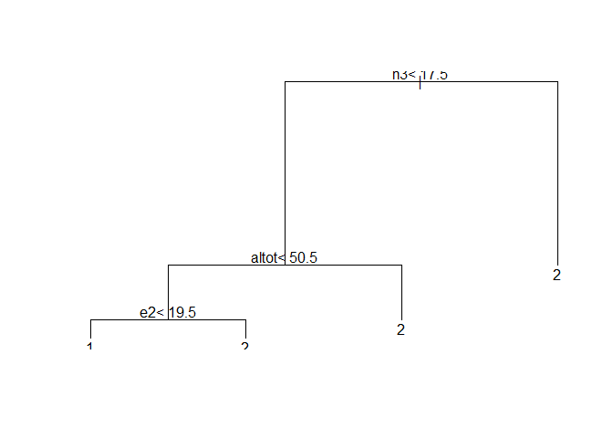

CART (rpart) bomen snoeien (prunen)
===================================

Voor een uitleg over pruning, zie het paper van Strobl, Malley en Tutz (2009).

In dit voorbeeld gebruiken we weer de dataset uit een van de eerdere weken:

``` r
library("foreign")
dep_data <- read.spss("data Carrillo et al.sav", to.data.frame = TRUE)
```

    ## re-encoding from UTF-8

Regressie en classificatie bomen die gemaakt zijn met de `ctree()`, `lmtree()` of `glmtree()` functies uit package **partykit** hoef je niet te snoeien (prunen). Bomen gemaakt volgens het CART algoritme (zoals geimplementeerd in functio `rpart()` uit package **rpart**) wel.

Voorbeeld: Regressieboom snoeien
--------------------------------

``` r
library("rpart")
dep_cart <- rpart(bdi ~ ., data = dep_data)
plot(dep_cart)
text(dep_cart)
```



We hebben hier niet zo'n grote dataset, en daardoor ook niet zo'n grote boom, met 6 splits en 7 terminal nodes. Toch zou deze boom te groot kunnen zijn om goed te generaliseren naar nieuwe observaties / data. Daarom gaan we nu dezelfde boom maken, en daarna 'snoeien' we er takken vanaf (prunen) met behulp van kruisvalidatie (cross validation). Voor de kruisvalidatie wordt de data random in *k* folds verdeeld (hier specificeren we *k* = 10 met `xval = 10`), daarom moeten we eerst de `set.seed()` functie gebruiken zodat we later onze resultaten precies kunnen reproduceren:

``` r
set.seed(1)
dep_cart2 <- rpart(bdi ~ ., data = dep_data, 
                   control = rpart.control(cp = 0, xval = 10))
```

We specificeerden ook `cp = 0`, zodat de oorspronkelijke boom zoveel mogelijk nodes heeft. Deze boom gaan we hierna snoeien met behulp van deze parameter. Als je wilt weten wat de `cp` parameter is, type je:

``` r
?rpart.control
```

We gaan nu bekijken welke waarde van `cp` de beste predictive accuracy zou opleveren, gebaseerd op de resultaten van de 10 − *f**o**l**d* cross validation:

``` r
cp_table <- printcp(dep_cart2)
```

    ## 
    ## Regression tree:
    ## rpart(formula = bdi ~ ., data = dep_data, control = rpart.control(cp = 0, 
    ##     xval = 10))
    ## 
    ## Variables actually used in tree construction:
    ## [1] altot e1    e2    n1    n3    n4    open4 open5
    ## 
    ## Root node error: 6822.9/112 = 60.919
    ## 
    ## n= 112 
    ## 
    ##           CP nsplit rel error  xerror    xstd
    ## 1  0.3764250      0   1.00000 1.01230 0.18391
    ## 2  0.0926223      1   0.62357 0.71100 0.09989
    ## 3  0.0699975      2   0.53095 0.75394 0.11249
    ## 4  0.0359120      3   0.46096 0.73509 0.10735
    ## 5  0.0207605      4   0.42504 0.74256 0.10771
    ## 6  0.0165255      5   0.40428 0.72515 0.10605
    ## 7  0.0085570      6   0.38776 0.73264 0.10660
    ## 8  0.0070157      7   0.37920 0.73743 0.10471
    ## 9  0.0049913      8   0.37218 0.72811 0.10274
    ## 10 0.0000000     10   0.36220 0.72432 0.10298

``` r
cp_table <- data.frame(cp_table)
```

Functie `printcp()` print de bovenstaande resultaten naar de command line. Ook geeft de functie 'onzichtbaar' de tabel die we hierboven zien, terug. Omdat we hierboven dat resultaat hebben weggeschreven naar `cp_table`, kunnen we die resultaten later weer gebruiken.

In de tabel zien we dat de laagste error werd gevonden bij een `cp` van 0.0926223. Dat levert een boom op met 1 splti. Nu gaan we `dep_cart2` snoeien met deze waarde van`cp`:

``` r
opt_cp_val <- cp_table$CP[which(cp_table$xerror == min(cp_table$xerror))][1]
```

Ik heb hier `[1]` toegevoegd, voor het geval er meerdere waarden van `cp` dezelfde `xerror` opleveren. Dan zal de eerste waarde gekozen worden (corresponderend met de kleinste aantal nodes).

``` r
dep_pruned <- prune.rpart(dep_cart2, cp = opt_cp_val)
plot(dep_pruned)
text(dep_pruned)
```



Zoals verwacht, een boom met 1 split.

Voorbeeld: Classificatieboom snoeien
------------------------------------

``` r
dep_data$sexo <- factor(dep_data$sexo)
set.seed(1)
gen_cart <- rpart(sexo ~ . - bdi - edad, data = dep_data,
                  control = rpart.control(cp = 0, xval = 10))
plot(gen_cart)
text(gen_cart)
```


``` r
cp_table <- printcp(gen_cart)
```

    ## 
    ## Classification tree:
    ## rpart(formula = sexo ~ . - bdi - edad, data = dep_data, control = rpart.control(cp = 0, 
    ##     xval = 10))
    ## 
    ## Variables actually used in tree construction:
    ## [1] altot e2    e4    e5    n3   
    ## 
    ## Root node error: 56/112 = 0.5
    ## 
    ## n= 112 
    ## 
    ##         CP nsplit rel error  xerror     xstd
    ## 1 0.357143      0   1.00000 1.28571 0.090552
    ## 2 0.107143      1   0.64286 0.82143 0.092972
    ## 3 0.035714      2   0.53571 0.85714 0.093522
    ## 4 0.017857      3   0.50000 0.80357 0.092650
    ## 5 0.000000      5   0.46429 0.80357 0.092650

``` r
cp_table <- data.frame(cp_table)
```

In de tabel zien we dat de laagste error werd gevonden bij een `cp` van zowel 0.01785714 als 0.000000. We kiezen de hoogste waarde en snoeien daarmee de boom:

``` r
opt_cp_val <- cp_table$CP[which(cp_table$xerror == min(cp_table$xerror))][1]
gen_pruned <- prune.rpart(gen_cart, cp = opt_cp_val)
plot(gen_pruned)
text(gen_pruned)
```



Meer info over snoeien (prunen)
-------------------------------

Om meer details te leren over het snoeien (prunen) in **rpart**, type:

``` r
browseVignettes("rpart")
```

Dan opent zich een webbrowser, klik op de 'PDF' link achter "Introduction to Rpart". Dan opent zich een pdf bestand, in hoofdstuk 4 wordt pruning uitgelegd.
